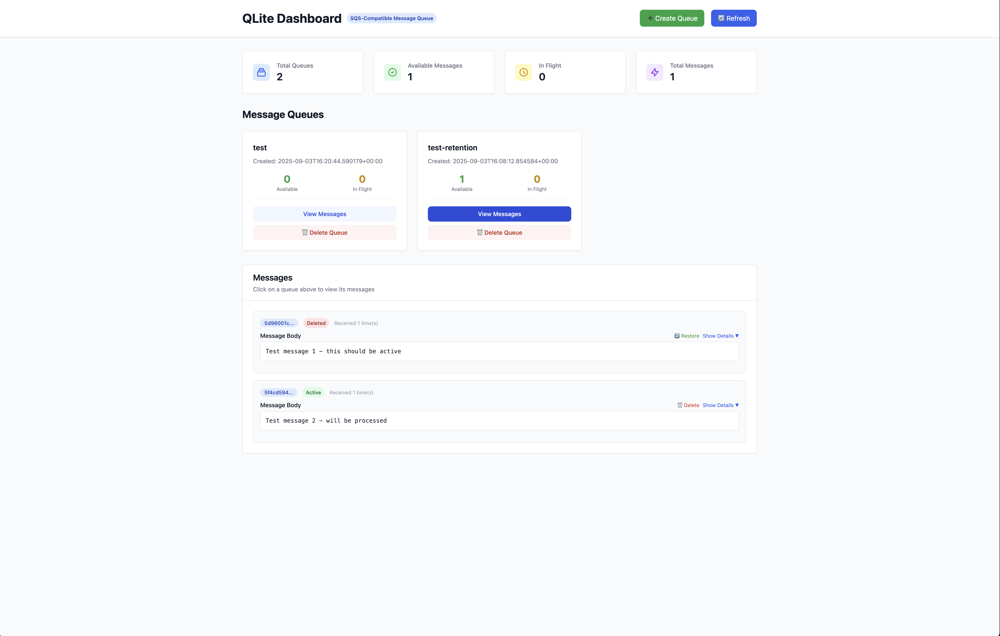

# QLite

A lightweight, SQS-compatible message queue backed by SQLite, written in Rust.
The Primary purpose of this tool is to easily facilitate local or cicd based
testing this project is not meant for production workloads and it is not recommended
to use it for them.

## Features

- **SQS-Compatible API**: Drop-in replacement for Amazon SQS with standard operations
- **SQLite Backend**: Persistent message storage with no external dependencies
- **Web UI**: Optional dashboard for queue monitoring and message browsing
- **CLI Interface**: Command-line tools for queue management

### Web UI


## Quick Start

### Installation

```bash
cargo build --release
```

### Start Server

```bash
# Basic server on port 3000
./qlite server --port 3000

# With web UI enabled
./qlite server --port 3000 --enable-ui
```

### CLI Usage

```bash
# Create a queue
./qlite create-queue my-queue

# Send a message
./qlite send my-queue "Hello, World!"

# Receive messages
./qlite receive my-queue

# Delete a message
./qlite delete my-queue <receipt-handle>
```

### Quick Start with AWS CLI

```bash
# Set dummy credentials (any values work)
export AWS_ACCESS_KEY_ID=dummy
export AWS_SECRET_ACCESS_KEY=dummy

# Start QLite server
cargo run -- server --port 3000

# Use AWS CLI exactly like with real SQS
aws sqs create-queue --endpoint-url http://localhost:3000 --queue-name test-queue
aws sqs list-queues --endpoint-url http://localhost:3000
aws sqs send-message --endpoint-url http://localhost:3000 --queue-url http://localhost:3000/test-queue --message-body "Hello World"
aws sqs receive-message --endpoint-url http://localhost:3000 --queue-url http://localhost:3000/test-queue
```

### SDK Integration Example

```python
# Python boto3 example
import boto3

sqs = boto3.client(
    'sqs',
    endpoint_url='http://localhost:3000',
    aws_access_key_id='dummy',
    aws_secret_access_key='dummy',
    region_name='us-east-1'
)

# Works exactly like AWS SQS
queue = sqs.create_queue(QueueName='my-test-queue')
sqs.send_message(QueueUrl=queue['QueueUrl'], MessageBody='Hello from Python!')
```
